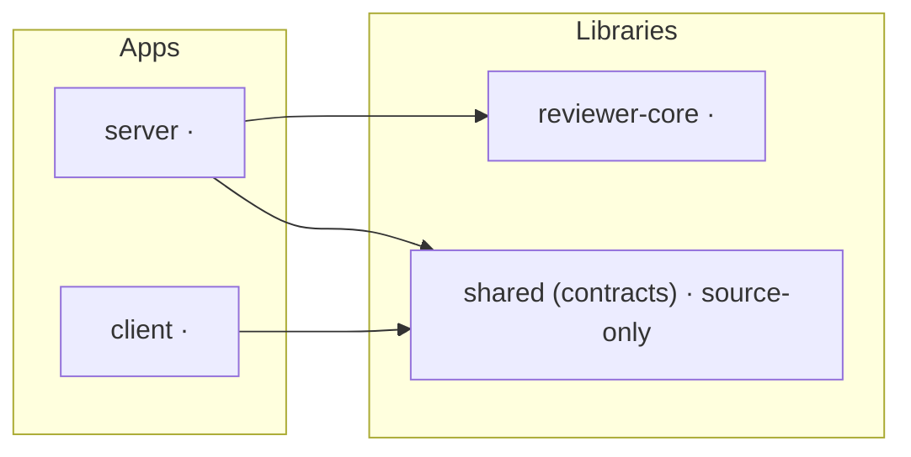

# Report template

Fill every section, in this order. Replace `<…>`. Keep tables sorted as stated.

````markdown
# Dependency report — <YYYY-MM-DD>

**Verdict:** <one line — e.g. "Healthy; 1 heavy unused dep and range drift on zod"> · **P0:** <n> · **P1:** <n> · **P2:** <n> · **P3:** <n>
**Scope:** <packages> · **Mode:** <offline | online> · **Branch:** <branch>

## 1. Summary

| Package | Manager | Prod | Dev | Installed (MB) | Unique pkgs | Top weight |
|---|---|---:|---:|---:|---:|---|
| <folder> | <pnpm/npm> | <n> | <n> | <MB \| n/a> | <n> | <dep (MB)> |

Total installed: <MB> across <n> packages · <n> declared dependencies.

## 2. Dependency map



> Edges = tsconfig path aliases (source-shared, no installed weight). Solid = allowed direction;
> mark a forbidden direction with `-.->|violates| `.

## 3. Weight

### 3.1 Heaviest dependencies (repo-wide, top 10)

| # | Dependency | Package(s) | Kind | Own (MB) | With transitive (MB) | Transitive pkgs |
|---:|---|---|---|---:|---:|---:|


### 3.2 Per package

For each package: a table of its top 5 deps (same columns as 3.1) and one sentence on
what dominates it (e.g. "Next.js is 53% of client's install").

> Sizes are on-disk file bytes; transitive totals overlap and do not sum.

## 4. Health findings

| Sev | Package | Dependency | Finding | Evidence |
|---|---|---|---|---|
| <P-tier> | <folder> | <dep> | <unused / undeclared / misplaced / drift / duplicate / outdated / vulnerable> | <number, grep result, or file:line> |

Sub-sections for **Outdated** and **Vulnerabilities** are filled from phase 2, or read
`not checked (offline)`.

## 5. Prioritised actions

### P0 — now
### P1 — soon
### P2 — planned
### P3 — nice to have

Each action:

- **<what>** — `<package>` — saves/prevents <number>
  - Why: <the evidence>
  - How (for a human to run): `cd <package> && <pnpm|npm> <command>`
  - Risk: <low/med/high — what could break, how to verify, e.g. `pnpm typecheck && pnpm test`>

An empty tier is written `None.`

## 6. Advice

3–5 bullets, repo-level and durable (e.g. "align `zod` ranges across packages", "keep
`testcontainers` out of the prod install"), not a repeat of section 5.

## 7. Method & limits

What was run (`collect.mjs`, phase-2 commands), what was `not checked`, and which numbers
are heuristic (unused candidates) vs exact (sizes).
````
