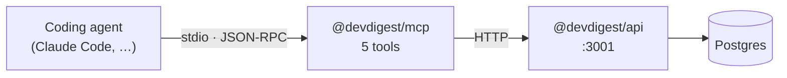

# `@devdigest/mcp`

A local **MCP server** that exposes DevDigest to coding agents: list the
reviewers you have configured, run one on a pull request, read the findings
back, and fetch a repository's extracted conventions — without leaving the
editor.

It speaks **stdio** to the agent and **HTTP** to the DevDigest API. It holds no
database connection and no credentials.



## The tools

| Tool | Writes? | Arguments |
|---|---|---|
| `list_agents` | no | — |
| `run_agent_on_pr` | **yes, billed** | `repo`, `pr`, `agent` |
| `get_findings` | no | `repo`, `pr`, `agent?`, `response_format?`, `limit?`, `offset?` |
| `get_conventions` | no | `repo`, `response_format?`, `limit?`, `offset?` |
| `get_blast_radius` | no | `repo`, `pr` — **stub**, see below |

`repo` is `"owner/name"` (a GitHub URL also works) and `pr` is the pull request
number. `agent` is a name exactly as `list_agents` reports it. Identifiers are
semantic on purpose: a uuid is unguessable without an extra round trip, and it
costs tokens to carry.

`run_agent_on_pr` is the only tool that starts a model run. It blocks until the
review finishes (~2 minutes at most) and returns the verdict with its findings —
the review endpoint is synchronous, so polling would only add billed turns for
data the first response already carries. If it times out, the run **keeps going
on the server**; collect it with `get_findings` rather than running it again.

`get_blast_radius` is a deliberate stub — Blast Radius is built on `repo-intel`'s
symbol graph and lands separately. It returns an explanation rather than an
error, because an error would invite a retry that cannot succeed.

## Setup

Nothing to install per developer: [`.mcp.json`](../.mcp.json) at the repo root
registers this server, so an MCP client picks it up automatically. Start the
stack first — the tools need the API:

```bash
./scripts/dev.sh          # Postgres + API :3001 + web :3000
```

Point it elsewhere with `DEVDIGEST_API_URL` (default `http://127.0.0.1:3001`).

Run it by hand, or against the MCP Inspector:

```bash
cd mcp && npm start
npx @modelcontextprotocol/inspector npx tsx mcp/src/server.ts
```

## Why it is this small

Tool definitions are loaded into a model's context **before the first word of a
conversation**, and are paid for on every request whether or not a tool is ever
called. Measured, a popular MCP server can cost ~17,600 tokens of definitions;
five servers together have been measured at ~55,000. Selection accuracy also
degrades once a model is choosing among more than roughly 30–50 tools.

So this server treats startup cost as a budget, not an afterthought:

- **five tools**, each a whole workflow rather than one endpoint;
- **flat primitive arguments**, which are cheaper to describe and where models
  make fewer mistakes than with nested objects;
- **`tools` capability only** — no resources or prompts to pull in at startup;
- **no work during `initialize`**;
- **allowlist projections**, so a reviewer's multi-thousand-token system prompt
  can never reach a model's context;
- **`response_format`, `limit` and `offset`** on the read tools, with a hard
  ceiling on any single result.

The whole `tools/list` payload is held **under 1500 tokens** by
[`test/token-budget.test.ts`](test/token-budget.test.ts), which prints the
current figure on every run so drift shows up while there is still headroom.

Deferred loading (MCP Tool Search) can cut startup cost further, but it is a
*client* setting — a server cannot switch it on. What a server owes it is a
name and description that are self-sufficient when matched on their own, which
is the rule each description here is written against.

## Tests

```bash
npm run typecheck
npm test
npm test -- token-budget   # prints the tools/list size
```

Hermetic: `fetch` is the only mock, since it is the only outside world this
package has.
