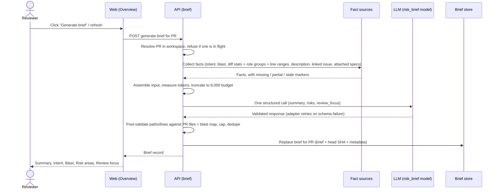
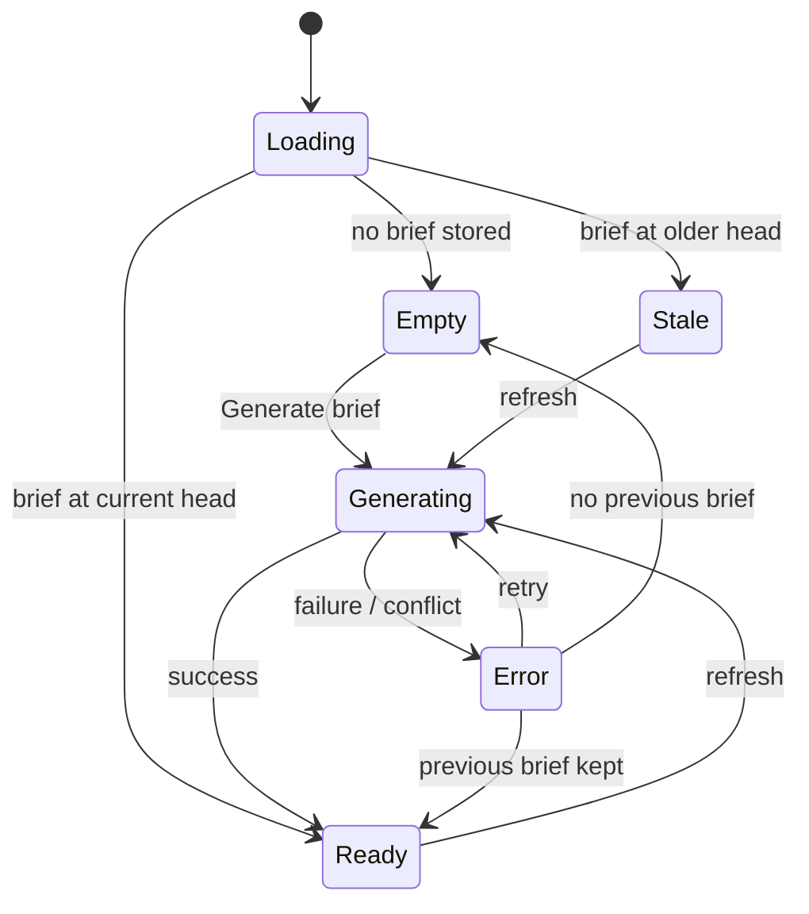

# Spec: PR Brief — one Why+Risk card on the PR Overview (HW05)

**Status:** draft · **Date:** 2026-09-30 · **Scope:** cross-module —
`server/` · `client/` · shared contracts (both vendored copies)

Prescriptive spec written by `spec-creator` before any plan exists. Lesson
feature L05 ("PR Brief card", `README.md:87`), built on this homework branch,
not on `main`.

## Sources reviewed

**Requirement as given:** the HW05 homework brief (Ukrainian, translated by
the caller), with P1/P2/P3 priorities, plus two design mockups:

- *Generated state* — a "PR BRIEF" section containing: a verdict banner
  (verdict label, "N findings · M blockers" badge, a summary paragraph, a
  refresh icon, a circular PR score, and a cost/tokens footer such as
  "$0.014 · 8.2K→1.3K"); an **Intent** block (quoted intent sentence, In scope
  / Out of scope lists); a **Blast radius** block (symbols / callers /
  endpoints / cron counts, per-symbol caller tree with `file:line`, endpoint
  and cron chips, Tree/Graph toggle); a **Risk areas** block of chips, each a
  severity/kind icon + title + `file:line` or `file:start-end`, with an
  expand chevron; a **Review focus — read these first** list with a count
  badge, items rendered `file:line — reason`; and a collapsed "Prior PRs
  touching these files" row (out of scope, P3 of L04).
- *Empty state* — the same "PR BRIEF" section header over a card reading
  "No brief yet" / "Generate a Why+Risk brief for this PR." with a primary
  "Generate brief" button, on the Overview tab.

**Existing specs checked for overlap** (`specs/README.md:57-60`): none covers
the brief.
- `specs/01-conventions.md` — conventions to skills; disjoint.
- `specs/02-project-context.md` — defines documents and their attachment to
  **agents and skills** (its FR-5, FR-7, FR-8, FR-9). This spec only *reads*
  that attachment model; it does not add a new attachment target (see FR-9
  and Open question 1).
- `server/specs/pr-cost-and-findings.md`, `client/specs/pr-findings-severity.md`,
  `reviewer-core/specs/grounding.md` — disjoint. The grounding principle in
  root `CLAUDE.md` ("a finding without a real diff-line citation is dropped")
  is the same principle FR-7/FR-8 apply to the brief.

**What the caller claimed exists vs. what this fork actually has** (verified
by reading the code, 2026-09-30):

| Claimed piece | Verdict | Evidence |
|---|---|---|
| `pr_intent` table + intent read ("getIntent") | **Exists.** Table has intent, in/out scope, confidence, *risk_areas* (label + evidence path, verified against changed paths), sources, provider/model, head SHA, tokens, cost. Staleness is derived on read against the PR head. | `server/src/db/schema/reviews.ts:75-100`; `server/src/modules/intent/service.ts:68-73,290-307`; `server/src/modules/intent/repository.ts` |
| `GET /pulls/:id/intent` / `POST` derive | **Exists** (not in the caller's list, but relevant). POST is a paid model call with a double-click guard (409). | `server/src/modules/intent/routes.ts:24-41`; `server/src/modules/intent/service.ts:57-86` |
| `GET /pulls/:id/blast` | **Exists.** No model call, no persistence; returns changed symbols, per-symbol callers (`file:line`), endpoints, crons, a summary string, plus `degraded`/`reason` when the index is unusable. | `server/src/modules/blast/routes.ts:33-40`; `server/src/modules/blast/service.ts:20-44`; `server/src/vendor/shared/contracts/brief.ts:52-84` |
| Smart Diff roles | **Exists.** `GET /pulls/:id/smart-diff`; five roles `core, tests, wiring, docs, boilerplate` in display order; per file additions/deletions and finding lines; split suggestion. | `server/src/modules/smart-diff/routes.ts:27-28`; `server/src/vendor/shared/contracts/brief.ts:121-164` |
| `pr_brief` table (`pr_id`, `json`) | **Exists, unused.** Primary key `pr_id` (FK → pull requests, cascade delete) and a non-null `json` jsonb column. Nothing in the server reads or writes it (only the schema declaration and the schema barrel reference it). **No migration is needed** to store a brief plus its head SHA and metadata inside `json`. | `server/src/db/schema/reviews.ts:102-107`; `server/src/db/migrations/0000_init.sql:211-214,386`; repo-wide grep for `prBrief`/`pr_brief` outside migrations |
| `brief.ts` contracts: Intent, Risk, Risks, PrBrief | **Exists**, both copies **byte-identical today** (`diff` clean). `Risk` = kind, title, explanation, severity (`high\|medium\|low`), file_refs[]; `PrBrief` = intent, blast, risks, history — all required, **no `summary`, no `review_focus`**. `PrBrief` has no consumer anywhere. | `server/src/vendor/shared/contracts/brief.ts:86-102,166-173`; `client/src/vendor/shared/contracts/brief.ts` (identical) |
| `risk_brief` feature model + resolver | **Exists.** `risk_brief` is a member of the feature-model id enum, labelled "Risk Brief — Assesses merge risks for a pull request", default `openai` / `gpt-4.1`; mirrored in the client's Settings registry. The resolver returns the workspace override or the registry default. No module calls it with `risk_brief` yet. | `server/src/vendor/shared/contracts/platform.ts:15-21,60-66`; `client/src/lib/feature-models.ts:30-33`; `server/src/modules/settings/feature-models.ts:50-57` |
| Structured LLM call with validation + retry | **Exists.** Result carries data, model, tokens in/out, cost, raw, and **attempts** (the adapter loops up to `maxRetries + 1`). | `server/src/vendor/shared/adapters.ts:60-86`; `server/src/adapters/llm/openai.ts:96,124` |
| `VerdictBanner` | **Exists** on the Findings tab only: verdict, summary, score, findings count, blockers, agent, cost/tokens. Takes summary as a plain input, so it can carry the brief's summary. Not on Overview; has no refresh affordance. | `client/src/app/repos/[repoId]/pulls/[number]/_components/VerdictBanner/VerdictBanner.tsx:12-80` |
| `client/messages/en/brief.json` | **Exists, unused** by any component (no `useTranslations("brief")`). Keys: `block.intent`, `block.blast`, `block.risks` ("Risks" — mockup says "Risk areas"), `block.history`, `noRisks`, `noHistory`, `overlap`, `unavailable`, `unavailableHint`, `why.*`. No keys for summary, review focus, generate, stale, or missing inputs. Namespaces are auto-loaded per file. | `client/messages/en/brief.json:1-19`; `client/src/i18n/request.ts:16-25` |
| Project Context attachments | **Exists**, but attachments target **agents and skills per repo**, not PRs. Documents have category `specs\|docs\|insights`, origin, availability `present\|missing`, and a stored token count. An "effective set for a run" resolver exists for one agent. | `server/src/db/schema/project-context.ts:47-93,95+`; `server/src/modules/project-context/service.ts:219,315`; `specs/02-project-context.md` FR-8/FR-9 |
| Overview tab | **Exists.** Renders the standalone Intent card, then the Blast Radius card, then the PR description. No brief. | `client/src/app/repos/[repoId]/pulls/[number]/_components/OverviewTab/OverviewTab.tsx:17-40` |
| `?tab=diff` deep-link to a file / line | **Tab exists, deep-link does not.** Tab state is `?tab` in the URL; the Files changed tab and the diff viewer have no file- or line-targeting parameter and no scroll-to behaviour. New capability. | `client/src/app/repos/[repoId]/pulls/[number]/page.tsx:53-61,167-176`; `client/src/app/repos/[repoId]/pulls/[number]/_components/DiffTab/DiffTab.tsx:1-60` |
| Linked issue | **Not persisted.** Intent resolves the first closing-keyword reference live over GitHub and degrades to absent on no token / offline. | `server/src/modules/intent/service.ts:221-240` |
| Server token counter | **Exists**: one shared counting scheme with a non-throwing chars/4 fallback, already shared by repo-intel and project-context. | `server/src/adapters/tokenizer/index.ts:1-30` |
| Brief module / endpoints | **Missing.** Module registry anticipates a "brief" module; none is registered. | `server/src/modules/index.ts:26-45` |

**INSIGHTS.md entries that constrained this spec** (server and client only;
root not read — the change stays within two packages plus contracts):

- `server/INSIGHTS.md:42-53` — a feature-model default pointing at a provider
  the integration tests do not mock makes the hermetic lane issue a live,
  billed call. `risk_brief` defaults to `openai`; see NFR-7.
- `server/INSIGHTS.md:100-112` — consuming another module's business logic
  goes through a service promoted onto the shared container, not a direct
  construction. Relevant because the brief consumes intent, blast, smart-diff
  and project-context facts (NFR-8).
- `server/INSIGHTS.md:22-30` — dedupe keys for LLM-proposed rows must never
  include user-editable text (informs how dropped/duplicate entries are
  counted, FR-8).
- `client/INSIGHTS.md:81-88` — the vendored badge takes no tooltip; a
  wrapping element is needed (relevant to risk chips showing a full path).
- `client/INSIGHTS.md:99-108` — Smart Diff group collapse state resets when
  the Files tab swaps views; a deep-link that lands on a file inside a
  collapsed group must expand it (FR-12).

**`researcher`:** not used. Every question was answerable by reading this
repo; nothing depends on external API behaviour.

## Goal

A reviewer opening a PR "cold" sees, on the Overview tab, one PR Brief card
that combines the already-computed Intent, Smart Diff role grouping and Blast
Radius with two new model-written parts — **Risk areas** (concrete risks,
each tied to a real file) and **Review focus** (which `file:line` to read
first, and why) — under a short what/why **summary**. The brief is produced
by exactly one model call over precomputed facts (never diff hunk bodies),
is cached against the PR's head commit, and reloads without regenerating.

## Assumptions (stated rather than asked)

- **A-1 — No hidden second model call.** Generating a brief never triggers
  intent derivation. If intent is absent the brief is generated without it
  (FR-10). Intent derivation stays its own action.
- **A-2 — Stale, not auto-regenerated.** After a new commit, reading the
  brief returns the old one flagged stale; only an explicit refresh pays for
  a new model call.
- **A-3 — Snapshot.** The intent and blast data shown inside a generated
  brief are the snapshot the model saw, so risks and focus items stay
  consistent with the context shown beside them. The stale flag covers drift.
- **A-4 — No duplication on Overview.** Once a brief exists, Intent and Blast
  radius render once, inside the brief. Before one exists, the existing
  standalone Intent and Blast Radius cards keep rendering below the empty
  brief card, so L03/L04 features don't regress (the mockup's empty state
  shows neither; see Open question 2).
- **A-5 — Project Context input** is the deduplicated union of documents that
  the repository's enabled review agents would receive (their own plus
  skill-inherited attachments, per `specs/02-project-context.md` FR-9),
  restricted to category `specs` and availability `present`, in first-seen
  order (see Open question 1).
- **A-6 — Line anchors.** Changed line ranges (the new-side start and length
  from each hunk header, numbers only) count as precomputed facts, not hunk
  bodies. They're the only way the model can name a real line.

## Functional requirements

| ID | Pri | Requirement |
|---|---|---|
| FR-1 | P1 | The PR Overview tab shows a "PR Brief" section at the top. While no brief exists for the PR it shows an empty state: "No brief yet", the hint "Generate a Why+Risk brief for this PR.", and a "Generate brief" button. |
| FR-2 | P1 | Clicking "Generate brief" generates and persists a brief, then shows it without a page reload: a **summary** (what the PR does and why, ≤ 3 sentences), **Risk areas**, **Review focus**, and, where available, the **Intent** block (intent sentence, in scope, out of scope) and the **Blast radius** block (counts, per-symbol callers with `file:line`, endpoints, crons), reusing the existing blast presentation. |
| FR-3 | P1 | Each risk shows at least its title and one file reference (`path`, `path:line` or `path:start-end`), plus a severity (`high`/`medium`/`low`) indicator and a kind. A risk with no surviving file reference after validation is not shown and not stored. |
| FR-4 | P1 | Each Review focus item shows `file:line — reason`. The list is headed "Review focus — read these first" with a count, ordered as the model ranked it (most important first). |
| FR-5 | P1 | Clicking a Review focus item switches to the Files changed tab (`tab=diff`) and brings the referenced file into view (expanded, scrolled to). The URL identifies the target file and line, so reload or a shared link lands in the same place. |
| FR-6 | P1 | Reloading the page (or returning to the PR later) shows the persisted brief with no model call. A refresh control on the brief regenerates it on demand and replaces the stored one only if generation succeeds. |
| FR-7 | P1 | Every file path in every stored risk reference and focus item is a real file: either a changed file of this PR or a file in this PR's blast map (a changed symbol's declaring file or a caller's file). Nothing else survives. |
| FR-8 | P1 | Post-validation after the model responds: (a) strip each risk file reference whose path fails FR-7, then drop risks left with none; (b) drop focus items whose file fails FR-7; (c) a focus item whose line isn't a line anchor of that file (inside a changed range, or a known caller line) is snapped to the nearest anchor of that file; (d) exact duplicates (same file+line in focus; same kind+file set in risks) are collapsed; (e) risks are capped at 6 and focus items at 8, keeping the model's order. Counts of what was dropped/snapped are recorded on the brief (Contracts). |
| FR-9 | P1 | Generation sends the model **only** these precomputed facts: PR title; intent (sentence, scopes, intent-proposed risk areas) if present; blast summary, changed symbols, and caller files with lines, endpoints, crons; diff stats (per changed file: path, role group, additions, deletions, changed line ranges; plus totals and per-role counts); PR description; linked issue (title + body) if resolvable; attached Project Context specs per A-5. It never sends diff hunk bodies, file contents from the clone, or review findings. |
| FR-10 | P1 | If intent, blast, linked issue, PR description or Project Context specs are missing (not derived / index unusable or degraded / no reference or unreadable / empty / none attached), the brief still generates. The brief records which inputs were missing, partial (degraded blast) or stale (intent from an older head), and the card says so in plain words ("Generated without: Intent, Blast radius"). The model is told the same, so it doesn't invent the missing context. |
| FR-11 | P2 | A persisted brief is bound to the head commit SHA it was generated from. When the PR's head moves, reading it returns it flagged **stale**. The card shows a stale marker next to the refresh control. No regeneration happens on read. |
| FR-12 | P2 | FR-5's navigation also scrolls to and highlights the exact line in that file, expanding any collapsed Smart Diff group or file card that hides it. |
| FR-13 | P2 | The model is chosen from the workspace's per-feature model setting for the **Risk Brief** feature (`risk_brief`), falling back to its registry default. No model or provider is fixed anywhere in the brief feature itself. |
| FR-14 | P2 | One generation equals one logical structured model call. The adapter's own schema-validation retries are the only permitted repetition. The server log line for a generation, and the brief's stored metadata, record provider, model, attempts, measured input tokens, output tokens, cost, and which input sections were truncated. |
| FR-15 | P2 | The model's response must validate against the brief output contract (summary, risks[], review_focus[]) before anything is persisted. A response that still fails after the adapter's retries fails the generation; the previous brief (if any) is left untouched. |
| FR-16 | P1 | Concurrent generation for the same PR is refused: a second generate request while one is in flight returns a conflict and makes no model call. The UI disables the button while generating. |
| FR-17 | P3 | A verdict banner tops the generated brief: verdict, findings/blockers count and PR score from the PR's **latest successful review** when one exists; the brief's summary as its text; the brief's cost and token usage; the refresh control. With no review, the banner shows the summary (mandatory) with no verdict or score. |
| FR-18 | P3 | A risk chip expands to show the risk's explanation. Clicking a risk's file reference navigates like FR-5. |
| FR-19 | P3 | When a navigation target is a blast-map file that isn't in this PR's diff, the Files changed tab opens and shows a "File not in this PR's diff" notice naming the file, instead of silently landing nowhere. |
| FR-20 | P3 | A skeleton of the brief layout shows while generation is in flight. A failed generation shows an error with a retry, and keeps any previous brief visible. |
| FR-21 | P3 | All brief copy comes from the `brief` message namespace: the existing keys are reused, `block.risks` reads "Risk areas", and new keys are added for the section title, empty state, generate/regenerate, generating, stale marker, summary, review focus heading and its empty state, missing-inputs line, "File not in this PR's diff", and the generation error. |
| FR-22 | P3 | A workflow retrospective and a cost report for the HW05 build accompany the delivery (per-generation cost is available from FR-14's metadata). |

## Non-functional requirements

| ID | Requirement |
|---|---|
| NFR-1 | **Input budget: 8,000 tokens** for the complete model input (system instructions + user message), counted with the server's single shared token-counting scheme (the one Project Context already uses, chars/4 fallback). The generation measures the assembled input before sending and stores the count. Output is capped at 1,500 tokens. |
| NFR-2 | **Truncation policy**, enforced before the call, never failing for size. Per-section ceilings: file list 2,000 · blast detail 1,500 · PR description 1,000 · linked issue 800 · Project Context specs 2,000. The remainder (≈700) goes to always-kept facts: instructions, title, totals, per-role counts, intent, blast summary and counts, missing-inputs note. Inside a section: files keep `core` first, then by churn, and omitted files collapse to "+N more <role> files". Callers keep the index's rank order and report omitted counts. Description and issue are cut at the ceiling with an explicit truncation marker. Spec documents go in whole, in A-5 order, and the first one that doesn't fit is cut with a marker, later ones skipped and listed by name. If the total still exceeds 8,000, sections shrink further in this order: specs → issue → description → callers → file list. Every truncated section is recorded (FR-14). |
| NFR-3 | **Untrusted input.** The PR description, linked issue, spec documents, and symbol/file names are untrusted. They reach the model wrapped with the same injection guard every other external prompt input already uses. Model output (summary, titles, explanations, reasons) is rendered as plain text, never markup. |
| NFR-4 | **Tenancy.** Both endpoints resolve the PR within the caller's workspace, answer "not found" otherwise, and never read or write another workspace's brief. |
| NFR-5 | **Cost/latency.** Reading a brief makes no model call and no GitHub call. Generation makes one model call, plus at most one GitHub read (linked issue) that degrades to "missing" on failure. |
| NFR-6 | **No schema migration.** The brief, its head SHA and its metadata live inside the existing per-PR brief row. Staleness is derived on read, never stored. |
| NFR-7 | **Hermetic tests.** Any test path that reaches generation mocks the `risk_brief` provider, so the hermetic lane never issues a live, billed call (`server/INSIGHTS.md:42-53`). |
| NFR-8 | **Additive and degradable.** The brief never breaks the Overview: if its read fails, the tab still shows the standalone Intent/Blast cards and the description, and the other tabs are unaffected. It consumes the intent, blast, smart-diff and project-context capabilities through their public service surfaces, not their data layers. |
| NFR-9 | **Contract parity.** The two vendored copies of the shared brief contracts stay byte-identical after the change, as they are today, the same way the Smart Diff role was propagated in L03. |

## Workflow

### Generate a brief

### Brief card states

## Service communication

- **Browser → API** over the existing authenticated HTTP surface:
  - *read brief* — `GET /pulls/:id/brief`: returns the stored brief record,
    or an explicit "none" (null, the same way the intent read does). Never
    calls the model.
  - *generate brief* — `POST /pulls/:id/brief`: generates, persists, and
    returns the new record; conflict if one is already in flight; not found
    outside the workspace.
- **Brief use case → in-process capabilities** (no new network hops): the
  persisted intent record; the blast-radius computation (repo index, never
  throws, may be degraded); PR files and their role classification; the PR's
  description; the linked-issue resolver (one GitHub read, degradable); the
  Project Context effective document set per A-5; the feature-model setting
  for `risk_brief`; the shared token counter.
- **Brief use case → LLM provider**: exactly one structured completion per
  generation.
- **Browser, on the Overview only for FR-17**: the latest review's verdict
  and score come from the reviews data the PR page already loads. The brief
  itself doesn't duplicate them.

## Contracts

All changes go in the shared brief contracts and are applied identically to
both vendored copies (NFR-9).

- **Review focus item** (new): `file` (repo-relative path), `line` (positive
  integer), `reason` (short plain-text sentence).
- **Risk** (unchanged): kind, title, explanation, severity
  (`high|medium|low`), file_refs. This spec defines the file_refs entry form
  as a path optionally suffixed `:line` or `:start-end`. Validation checks
  the path part only (FR-7).
- **Model output** (new, named for the structured call): `summary` (string,
  ≤ ~400 characters), `risks` (list of Risk), `review_focus` (list of Review
  focus item).
- **Composed PR Brief** (changed): adds `summary` and `review_focus`. `intent`
  and `blast` become *absent-able* (null when that input was missing at
  generation time, FR-10). `risks` and `history` keep their shapes, and
  `history` is always empty (Prior PRs is out of scope). Safe to change:
  nothing consumes the composed type today.
- **Brief record** (new, the wire shape of both endpoints and the stored
  JSON minus the derived flag): the composed brief plus `pr_id`, `head_sha`,
  `generated_at`, `is_stale` (derived on read, not stored), `provider`,
  `model`, `attempts`, `tokens_in`, `tokens_out`, `cost_usd`,
  `input_tokens_measured`, `truncated_sections` (list of section names),
  `inputs` (per input: `present | missing | partial | stale`), and
  `validation` counts (risks dropped, refs stripped, focus dropped, focus
  lines snapped, duplicates collapsed). This mirrors the intent record's
  "domain shape + provenance" pattern.
- **Files-changed deep link** (new, client URL): carries the Files changed
  tab plus a target file and an optional target line. Survives reload.
- **Feature model id** `risk_brief`: already exists, no change.
- **Persistence**: the existing per-PR brief row (one row per PR, JSON
  payload). Regeneration replaces it. No new table, no column, no migration.

## Traceability

| Requirement | Addressed by |
|---|---|
| FR-1 | Card states: Empty · Contracts: read brief returns "none" |
| FR-2 | Workflow: Generate · Contracts: Composed PR Brief (summary, risks, review_focus, intent, blast) |
| FR-3 | Contracts: Risk, file_refs entry form · FR-8(a) |
| FR-4 | Contracts: Review focus item · FR-8(e) ordering |
| FR-5 | Contracts: Files-changed deep link |
| FR-6 | Service communication: read never calls the model · Card states: refresh · FR-15 keeps previous |
| FR-7 | Workflow: post-validate step · Contracts: brief record validation counts |
| FR-8 | Workflow: post-validate step · Assumption A-6 (line anchors) |
| FR-9 | Workflow: collect facts · NFR-2 sections · Assumption A-5 |
| FR-10 | Contracts: `inputs` map, absent-able intent/blast · Assumption A-1 |
| FR-11 | Contracts: `head_sha`, derived `is_stale` · Card states: Stale · Assumption A-2 |
| FR-12 | Contracts: deep link optional line |
| FR-13 | Service communication: feature-model setting · Contracts: `risk_brief` |
| FR-14 | Contracts: brief record provenance fields · NFR-1 measurement |
| FR-15 | Workflow: validated response · Card states: Error → previous brief kept |
| FR-16 | Workflow: refuse if in flight · Card states: Error (conflict) |
| FR-17 | Service communication: latest review data · Contracts: summary, cost/tokens |
| FR-18 | Contracts: Risk explanation, file_refs · Contracts: deep link |
| FR-19 | Contracts: deep link · FR-7 (blast-only files are valid targets) |
| FR-20 | Card states: Generating, Error |
| FR-21 | Sources reviewed: existing brief message namespace |
| FR-22 | Contracts: brief record cost/token fields |
| NFR-1 | Workflow: measure tokens · Contracts: `input_tokens_measured` |
| NFR-2 | Workflow: truncate step · Contracts: `truncated_sections` |
| NFR-3 | Workflow: assemble input · FR-2 plain-text rendering |
| NFR-4 | Service communication: workspace resolution on both endpoints |
| NFR-5 | Service communication: read path has no model/GitHub call |
| NFR-6 | Contracts: Persistence |
| NFR-7 | Service communication: LLM provider via `risk_brief` |
| NFR-8 | Assumption A-4 · Service communication: in-process capabilities |
| NFR-9 | Contracts: preamble |

## Verification hint

- **FR-1/FR-2/FR-6:** on a seeded PR with no brief, Overview shows the empty
  card. Generating shows summary, Risk areas and Review focus. A reload
  shows the identical brief, and the LLM mock records zero additional calls.
  Refresh records exactly one more.
- **FR-7/FR-8:** a mocked model response citing an invented path, a
  blast-only caller path, an out-of-range line, and 10 focus items leaves
  only real paths, snapped lines, ≤ 8 focus items, and matching validation
  counts in the stored record.
- **FR-9/NFR-1/NFR-2:** the captured model input for a PR whose description,
  specs and file list together exceed the budget measures ≤ 8,000 tokens,
  lists the truncated sections, and contains no hunk body text (no line of
  any file's patch body appears in it).
- **FR-10:** with intent never derived and an unindexed repo, generation
  succeeds, `inputs` marks intent missing and blast partial, and the card
  names both.
- **FR-11:** changing the PR's head after generation makes the read return
  `is_stale: true` with no model call, and the card shows the stale marker.
- **FR-13/FR-14:** setting `risk_brief` to a different mocked provider/model
  routes the single call there, and the server log shows one generation line
  with attempts, tokens and cost.
- **FR-15/FR-16:** a mock that always returns an invalid shape fails the POST
  and leaves the prior brief intact. Two overlapping POSTs yield one success
  and one conflict, with one model call.
- **FR-5/FR-12/FR-19:** clicking a focus item lands on `tab=diff` with that
  file expanded and the line in view. Reloading that URL does the same. A
  blast-only target shows the "not in this PR's diff" notice.
- **NFR-4:** reading or generating another workspace's PR returns not found.
- **NFR-9:** the two vendored brief contract copies diff clean.

## Out of scope

- "Prior PRs touching these files" (L04 P3). `history` stays in the contract
  and is always empty.
- Auto-regenerating a brief on new commits or on review completion.
- Deriving intent (or any other model-backed fact) as part of brief
  generation.
- Attaching Project Context documents to a PR or to the brief directly.
- Sending hunk bodies, clone file contents, or review findings to the model.
- Changing how reviews, intent or blast radius are computed.
- Merging any of this to `main`.

## Open questions

1. **Which Project Context documents feed the brief?** Attachments exist only
   for agents and skills. The default (A-5) is the `specs`-category union
   over the repo's enabled review agents. Alternatives: every `present` spec
   of the repo (simpler, but larger and budget-bound), or a dedicated brief
   attachment set (a new attachment target, which needs a schema change).
   Needs a human decision.
2. **Standalone Intent/Blast cards before a brief exists.** The empty-state
   mockup shows only the brief card. The default (A-4) keeps the existing
   cards below it until a brief is generated, so they don't regress. Confirm,
   or hide them in the empty state as the mockup does.
3. **Line snapping vs. dropping.** FR-8(c) snaps an unanchored focus line to
   the nearest anchor of the same file. Stricter option: drop the item.
   Snapping keeps more useful items but can point a line or two off the
   model's intent.
4. **Budget figures.** 8,000 input / 1,500 output tokens and the per-section
   ceilings are chosen, not measured. Confirm they fit the `risk_brief`
   default model's pricing expectations for the cost report (FR-22).

## Self-check

- [x] No file path, function/class name, library choice, or code appears
      outside *Sources reviewed* (which cites file:line by design). Endpoint
      routes, the `risk_brief` id, and the `tab=diff` query value are API
      surface / contract values, not implementation.
- [x] Every FR/NFR has at least one Traceability row (FR-1–FR-22,
      NFR-1–NFR-9).
- [x] Every claim in *Sources reviewed* traces to a file:line read in this
      repo, or to the mockups and requirement as given. `researcher` was not
      needed.
- [x] Existing specs checked for overlap: `01-conventions` disjoint;
      `02-project-context` only read from, never contradicted (no new
      attachment target); package specs disjoint.
