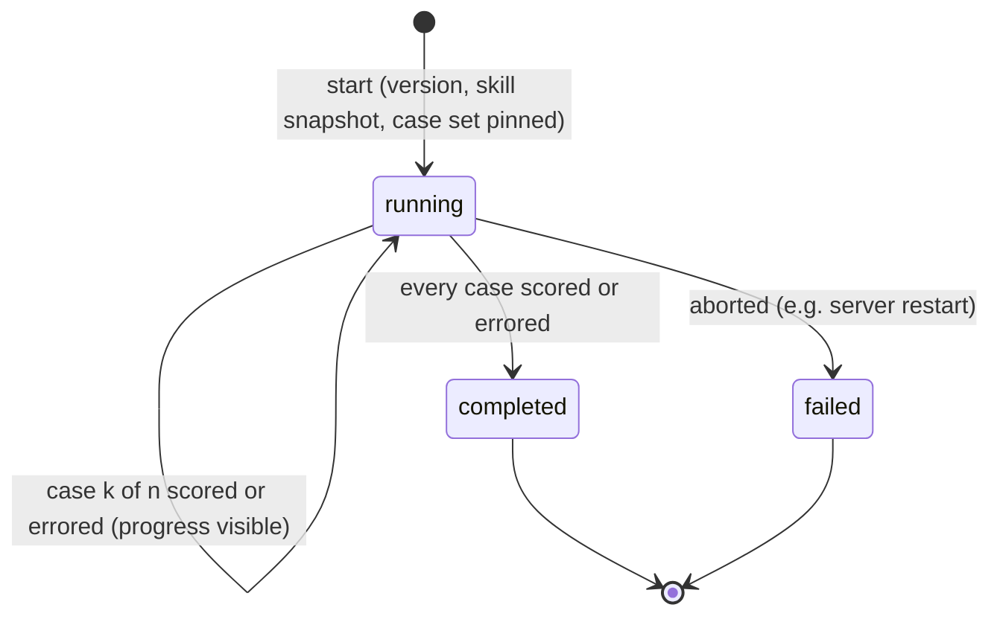

# Spec: Eval pipeline — regression harness for reviewer agents (L06)

**Status:** draft · **Date:** 2026-10-07 · **Scope:** cross-module — `server/` · `client/` · shared contracts (`reviewer-core` consumed unchanged as the review engine)

## Sources reviewed

- **Requirement as given.** Root README lesson table, row L06 ("Eval
  pipeline · Secret/Phantom gates · Plan Verifier · Export to CI"). Only
  *Eval pipeline* is in scope.
- **Official L06 homework text** (relayed by the coordinator, 2026-10-07).
  It is authoritative for terminology: expectation kinds `must_find` /
  `must_not_flag`, and metric names `recall` / `precision` /
  `citation_accuracy`. It also supplies the five user stories, the acceptance
  criteria, the demo scenario and the `pnpm verify:l06` gate. Its framing:
  - cases live in Postgres next to the findings they come from;
  - the accept/dismiss decisions from L01–L05 are the dataset.
- **User decisions on the first draft's open questions** (relayed by the
  coordinator, 2026-10-07). Each is reflected in the FR/AC cited here.

  | # | Decision | Reflected in |
  |---|---|---|
  | 1 | File named by catalog convention | this file name |
  | 2 | Promote creates a **new** agent version copied from vN | FR-23 |
  | 3 | A change that touches only linked skills does **not** create a new agent version. Each run snapshots the linked-skill state, and Compare shows skill differences | FR-12, FR-22, FR-24 |
  | 4 | Frozen files are reference-only | FR-6, FR-7, NFR-1 |
  | 5 | Run execution is the author's call: optimal and convenient for the end user | FR-28 |
  | 6 | The "Precision dipped" banner fires on a drop of ≥ 1 point | FR-21 |
  | 7 | Generated case names are at most ~80 characters | FR-5 |
  | 8 | Unmatched findings on `must_find` cases are not noise | FR-16 |
  | 9 | Not answered; this spec's interpretation stands | Notes |
- **Design mockups** (8 images supplied with the request):
  1. Review Runs finding card with *Turn into eval case*.
  2. Case modal seeded from an accepted finding (POSITIVE CASE).
  3. Eval Dashboard.
  4. Per-agent eval detail with the precision-dip banner, the trend chart, and recent runs with Compare.
  5. Compare runs modal with metric deltas, the system-prompt diff and *Promote*.
  6. Agent editor *Evals* tab.
  7. Hand-made case editor.
  8. Case seeded from a dismissed finding (NEGATIVE CASE).
- **Existing groundwork** (verified by reading, plus `researcher` reports):
  - **Eval cases already persist.** Each has an owner kind (skill | agent), an
    owner id, a name, frozen input (diff text, files, PR meta), expected
    output (free JSON) and notes — `server/src/db/schema/eval.ts:7-20`.
  - **Eval runs persist one row per single case execution.** Each row holds
    the case, ran-at, actual output, pass, the three metrics, duration and
    cost — `server/src/db/schema/eval.ts:22-35`. Missing today: an agent-wide
    run grouping, the agent version, a linked-skill snapshot, the expectation
    kind and a source-finding link.
  - **Shared eval contracts exist.**
    - Base shapes: `server/src/vendor/shared/contracts/knowledge.ts:49-84`.
      Their metrics are required numbers in `[0,1]`, so "not applicable"
      cannot be expressed today.
    - API shapes: `server/src/vendor/shared/contracts/eval-ci.ts:19-98`. They
      include a dashboard aggregate with a free-text `alert`.
    - The server and client copies are identical today (`diff -rq`,
      2026-10-07).
  - **Agent version history.**
    - Every agent config change bumps an integer version and stores an
      immutable snapshot. The snapshot covers provider, model, system prompt,
      output schema, strategy, CI gate, the repo-intel flag and the ordered
      linked skill ids at snapshot time —
      `server/src/modules/agents/repository.ts:121-190`,
      `server/src/vendor/shared/contracts/knowledge.ts:222-245`.
    - Read-only version-list and version-detail endpoints exist —
      `server/src/modules/agents/routes.ts:25-26,127-142`.
    - There is no promote, active-version or restore concept.
    - Seeded agents have no snapshot until first edited —
      `server/src/db/seed.ts:345-348`.
    - Re-linking skills does not bump the agent version. That behaviour stays
      as it is (decision 3).
  - **Skill versions.** Skills carry their own version history (client skill
    versions hook and Versions tab — `client/src/lib/hooks/skills.ts:70-93`,
    `client/src/app/skills/constants.ts:4`).
  - **Review runs.** The agent version is stored only inside the run-trace
    document — `server/src/db/schema/runs.ts:9-45`,
    `server/src/modules/reviews/run-executor.ts:336`.
  - **Finding decisions are persisted.** Accept and dismiss are mutually
    exclusive timestamps on the finding —
    `server/src/db/schema/reviews.ts:33-59`,
    `server/src/modules/reviews/repository/review.repo.ts:119-142`.
    - Only the accept and dismiss routes exist. *Learn* and *Reply* are
      rejected as unavailable in the starter —
      `server/src/modules/reviews/routes.ts:18,149-157`,
      `server/src/modules/reviews/findings.ts:12-35`.
    - The card renders Accept and Dismiss only —
      `client/src/app/repos/[repoId]/pulls/[number]/_components/FindingCard/FindingCard.tsx:105-125`.
    - A finding carries severity (`CRITICAL|WARNING|SUGGESTION`), category
      (`bug|security|perf|style|test`), kind, file, a start and end line, and
      confidence — `server/src/vendor/shared/contracts/findings.ts:11-63`.
  - **The review engine can run on frozen input.** It is a pure function of
    the parsed diff, the system prompt, the model, optional caller-supplied
    context strings (including skills) and an injected provider. It touches
    no GitHub, clone, DB or filesystem — `reviewer-core/src/review/run.ts:163-275`.
    An existing engine test runs it on a canned diff with a stub provider —
    `reviewer-core/test/run.test.ts:46-70`.
    - PR title and author reach the model only through a task line —
      `server/src/modules/reviews/helpers.ts:83-93`.
    - **File contents are not an engine input**. The engine sees only the diff
      text — `reviewer-core/src/prompt.ts:227`.
    - Optional context is omitted when empty —
      `reviewer-core/src/prompt.ts:185-227`.
    - The engine returns grounded findings, dropped findings with reasons,
      tokens and cost, but **no duration** — `run.ts:257-275`.
    - It exposes progress and cancellation hooks — `run.ts:247-254`.
  - **Grounding rules.** A finding survives only if its file exactly equals a
    diff file path **and** its line range intersects that file's new-side hunk
    lines. Added and context lines count; deleted lines do not. The kinds
    `secret_leak`, `lethal_trifecta`, `phantom` and `hook` need only the file —
    `reviewer-core/src/grounding.ts:75,83-143`,
    `reviewer-core/specs/grounding.md:10-29`.
  - **UI scaffolding.** An eval message catalog exists —
    `client/messages/en/eval.json`. The rest is missing:
    - no eval server module or routes — `server/src/modules/index.ts:28`;
    - no Evals tab in the agent editor, which has only Config, Skills and
      Context — `client/src/app/agents/[id]/_components/AgentEditor/constants.ts:12-16`;
    - no Eval Dashboard nav item — `client/src/vendor/ui/nav.ts:34-46`.
  - **No `verify:*` script** exists in any package (researcher grep).
- **INSIGHTS.md entries that constrain this spec.** The root `INSIGHTS.md` has
  nothing relevant.
  - `server/INSIGHTS.md` (2026-09-24). A hermetic test turns live and billed
    when any provider the review path touches is left unmocked. Constrains
    NFR-9.
  - `server/INSIGHTS.md` (2026-09-21). Stats over historical rows must exclude
    rows that predate the feature. Constrains *Edge cases*.
  - `client/INSIGHTS.md` (2026-09-21). Pre-scaffolded i18n copy can describe
    an intended design rather than the real pipeline, so the existing eval
    catalog is a starting point, not a spec.
- **Prior art** (research input only, not normative).
  `upstream/fix/numbered-diff-line-citations:plans/12-eval-pipeline.md` chose:
  - the same two expectation kinds;
  - "not applicable" for zero denominators;
  - the same precision formula;
  - errored cases excluded from metrics;
  - a frozen per-file diff;
  - background runs with polling;
  - promote deferred, with the documented design "new version from vN's
    config".

  It also notes that seeded PR #482 has empty stored patches, so it cannot
  seed cases. `upstream/full-functionality` implements that plan with an
  80-character slug cap.
- **Overlap check.** None of these covers evals, so there is no conflict:
  - `specs/01-conventions.md`
  - `specs/02-project-context.md`
  - `specs/03-pr-brief.md`
  - `server/specs/pr-cost-and-findings.md`
  - `client/specs/pr-findings-severity.md`

## Goal

A reviewer agent gets a regression harness inside the product.

- **One-click cases.** Any accepted or dismissed finding becomes a frozen eval
  case in one click: `must_find` from an accepted finding, `must_not_flag`
  from a dismissed one.
- **Mechanical scoring.** A run executes the agent's whole case set in the
  background, against a pinned agent version and a snapshot of its linked
  skills. It produces `recall` / `precision` / `citation_accuracy` with
  **no model call in the scorer**.
- **Comparison and promotion.** After a change to the system prompt, the model
  or the linked skills, the user compares two runs side by side. The numbers
  show whether the agent got better or worse, and the better version can be
  promoted.

## User stories

- **US-1** — As a reviewer, I want to turn an accepted finding into a
  `must_find` eval case in one click, so that the agent is held to finding it
  again.
- **US-2** — As a reviewer, I want to turn a dismissed finding into a
  `must_not_flag` eval case in one click, so that the agent is held to not
  repeating that noise.
- **US-3** — As an agent author, I want to create and edit eval cases by hand,
  so that I can cover behaviour no real PR has produced yet.
- **US-4** — As an agent author, I want to see every case in an agent's set
  with its kind, expectation and last result, so that I know what the agent is
  tested against.
- **US-5** — As an agent author, I want to run the agent on all cases of its
  set (or on one case) and follow its progress, so that I get a fresh
  measurement without babysitting the page.
- **US-6** — As an agent author, I want to see a run's metrics, pass count and
  cost, plus the trend over runs, so that I can tell whether the agent is
  improving.
- **US-7** — As an agent author, I want to compare two runs side by side ("old
  prompt vs new", or "old skills vs new"), so that I can attribute a metric
  change to a config change.
- **US-8** — As an agent author, I want to promote the agent version a run was
  made with, so that the better prompt becomes the active one.
- **US-9** — As a team lead, I want one Eval Dashboard with every agent's
  latest eval results and the recent runs across agents, so that I can spot a
  regression without opening each agent.

## Functional requirements

| ID | Requirement | Story | Acceptance criteria |
|---|---|---|---|
| FR-1 | A finding card offers **Turn into eval case** next to the existing actions. It is enabled when the finding has a persisted accept or dismiss decision. | US-1, US-2 | AC-1: enabled on an accepted finding. · AC-2: enabled on a dismissed finding. · AC-3: disabled (or hidden) on a finding with no decision, with a hint that a decision is required first. |
| FR-2 | Triggering FR-1 opens the eval-case modal **seeded from the finding**. The case is owned by the agent that produced the finding. Saving needs no further typing: one click to open, one to save. Triggering it again on the same finding re-opens the existing case instead of duplicating it. | US-1, US-2 | AC-4: the subtitle reads "Seeded from a accepted / dismissed finding", matching the decision. · AC-5: the seeded case can be saved without editing any field. · AC-6: the saved case is linked to its source finding and records the decision. · AC-7: seeding the same finding twice yields one case. |
| FR-3 | An **accepted** finding seeds a `must_find` case. The banner reads "POSITIVE CASE — MUST find "<title>" at <file>:<start_line>". The expected output is one finding skeleton: severity, category, title, file and start line, plus the end line when it differs. | US-1 | AC-8: the case kind is `must_find`. · AC-9: the expected output equals the finding's severity, category, title, file and line range. · AC-10: the banner shows the title and `file:line`. |
| FR-4 | A **dismissed** finding seeds a `must_not_flag` case. The banner reads "NEGATIVE CASE — MUST NOT comment on <file>:<line> (<title>)". The expected output shows an empty list with an "assert empty" badge. The case stores the forbidden location (file + line range). | US-2 | AC-11: the case kind is `must_not_flag`. · AC-12: the forbidden location equals the finding's file and line range. · AC-13: the panel shows an empty list and the "assert empty" badge. |
| FR-5 | The seeded case name is a kind-prefixed slug of the finding title: `must-find-…` for positive, a negative prefix for `must_not_flag`. It is lower-case and hyphen-separated, at most **80 characters**, and unique within the agent's set. | US-1, US-2 | AC-14: "Hardcoded Stripe secret key in commit" seeds a name beginning `must-find-hardcoded-stripe-secret-key`. · AC-15: no seeded name exceeds 80 characters; longer titles are truncated without leaving a trailing hyphen. · AC-16: two findings with the same title seed distinct names. |
| FR-6 | The seeded case's **input is frozen at creation**. It holds the stored diff for the finding's file, that file as a reference-only file entry, and the PR meta (number, title, description). Later changes to the PR, its clone, the review or the finding never alter the case. The expected location must fall on citable lines of the frozen diff. | US-1, US-2, US-5 | AC-17: after the source PR is re-synced or the review or finding is deleted, the case input is unchanged. · AC-18: the Diff, Files and PR meta tabs show the frozen input. · AC-19: seeding is refused with a clear message when no stored diff exists for that file or the finding's lines are not citable in it. |
| FR-7 | Users can create a case by hand from the agent's Evals tab. The form has: a required name; input tabs Diff, Files and PR meta (Files is **reference only**, labelled as not sent to the agent); an expected-output editor with a live "valid JSON" / "invalid JSON" badge; and a **Finding skeleton** button that inserts a template. The case kind (`must_find` / `must_not_flag`) is chosen explicitly. | US-3 | AC-20: Save is refused while the name is empty or the expected output is invalid JSON or the wrong shape. · AC-21: Finding skeleton inserts severity, category, title, file and start line. · AC-22: `must_find` needs at least one expected finding; `must_not_flag` needs an empty expected output. · AC-23: the Files tab states that its content is reference-only. |
| FR-8 | Cases can be edited and deleted. The editor offers **Run case**, **Save**, **Cancel** and a **Run on save** toggle. After a run it shows "Last run passed / failed · expected N finding(s), got M · <duration> · <cost>". | US-3, US-5 | AC-24: with Run on save on, saving triggers a single-case run and the result line appears. · AC-25: deleting a case removes it from the set, and historical runs keep their recorded results. · AC-26: for `must_not_flag`, N is 0 and M counts grounded findings at the forbidden location. |
| FR-9 | The agent editor gains an **Evals** tab. It shows metric tiles (recall, precision and citation accuracy, each with its delta vs the previous run, plus traces passed `x/y`), the note "Scoring is mechanical — a finding counts when file matches and line ranges overlap. No model call in the scorer.", and a link to the full dashboard. | US-4, US-6 | AC-27: the tiles show the latest full run and its signed deltas vs the run before. · AC-28: with no runs, the tiles show an explicit empty state, not zeros. |
| FR-10 | The Evals tab lists every case in the set. Each row shows a pass / fail / never-run icon, the name, a kind badge (**MUST FIND** / **MUST NOT FLAG**), "expected N finding(s), got M", a severity · category chip (or "assert empty"), and run / edit / delete. The header shows "<passing> / <with a result> passing" and "<total> cases", plus **Run all evals** and **New eval case**. | US-4 | AC-29: 9 cases, 8 with a result and 6 passed, shows "6 / 8 passing" and "9 cases". · AC-30: every case shows its kind badge. |
| FR-11 | The Evals tab shows the agent's run history: recent full runs with version, time, metrics, pass count and cost. | US-7 | AC-31: full runs are listed newest first, each with its agent version. |
| FR-12 | **Run all evals** executes every case in the set as one **eval run**. The run is pinned at start to three things: the current agent version, the **snapshot of linked skills** (which skills, their order, and each skill's content state, i.e. its own version), and the case set. Each case goes through the same review engine and grounding gate as a real review, using only the case's frozen diff and PR meta plus the pinned configuration. | US-5 | AC-32: the run records agent version, model, linked-skill snapshot, covered case set, start and finish times, status, per-case results, cost and duration. · AC-33: editing the agent or its skills mid-run does not change what that run uses. · AC-34: two runs with the same version, the same skill snapshot and the same unchanged set give the model byte-identical input. |
| FR-13 | A **single-case run** (row run button / Run case) executes one case against the current version and current linked skills. It updates that case's last result, but it does not create a full eval run and does not appear in history, trend or dashboard. | US-5 | AC-35: after a single-case run, the case's last result updates and the run-history count is unchanged. |
| FR-14 | Scoring is **mechanical and deterministic**: pure code over stored outputs, never a model call. A grounded finding matches an expectation when the file paths are equal and the inclusive line ranges intersect. An expectation with only a start line is the range `[start, start]`. | US-6 | AC-36: scoring a run makes zero model/provider calls. · AC-37: scoring the same stored outputs twice yields identical results. · AC-38: `src/a.ts` lines 10–14 matches `src/a.ts:12`; lines 13–14 do not; a different file never matches. |
| FR-15 | Case pass rule. A `must_find` case passes iff **every** expected finding is matched by at least one grounded finding. A `must_not_flag` case passes iff **zero** grounded findings match its forbidden location. A hand-made `must_not_flag` case with no location passes iff there are zero grounded findings at all. | US-6 | AC-39: `must_find` with 1 expectation passes with 1 matching finding and fails with 0. · AC-40: `must_not_flag` fails with 1 finding at the forbidden location and passes with findings only elsewhere. · AC-41: `must_not_flag` with no location fails on any grounded finding. |
| FR-16 | Run metrics cover non-errored cases only. **recall** = matched `must_find` expectations ÷ all `must_find` expectations. **precision** = 1 − (grounded findings matching a `must_not_flag` forbidden location ÷ all grounded findings). Grounded findings on `must_find` cases that match no expectation are unlabelled and are **not** noise. **citation_accuracy** = grounded findings ÷ all findings emitted before the grounding gate. | US-6 | AC-42: 4 of 5 expectations matched gives recall 0.8. · AC-43: one `must_not_flag` case and 4 grounded findings, 1 at the forbidden location, gives precision 0.75. · AC-44: 10 emitted and 9 grounded gives citation_accuracy 0.9. · AC-45: a grounding-dropped finding counts only against citation_accuracy. · AC-46: an extra unmatched finding on a `must_find` case leaves precision unchanged. |
| FR-17 | A **zero denominator** yields "not applicable", never `0` or `1`. This covers recall with no `must_find` expectations, precision with no grounded findings, and citation_accuracy with no emitted findings. A not-applicable metric renders as "—", is skipped in trends, and has no delta. | US-6 | AC-47: only `must_not_flag` cases gives recall not applicable. · AC-48: no emitted findings gives precision and citation_accuracy not applicable. · AC-49: no delta is shown against a not-applicable value. |
| FR-18 | A case whose execution fails (provider error, timeout, unparseable output) is **errored**, with a reason. It is excluded from every metric numerator and denominator. It counts in the total but not as passed, and it does not stop the other cases. | US-5, US-6 | AC-50: with 1 of 8 cases errored, the run completes, shows "x/8" and the errored case with its reason, and its metrics equal those of the 7 scored cases. |
| FR-19 | The **Eval Dashboard** is a separate page under **Skills Lab → Eval Dashboard** in the left sidebar. It has one row per agent with cases: name, model, recall sparkline, last run version and time, passed/total, and RECALL / PREC / CITE. It also has **Run all agents** and a "Recent eval runs · all agents" table (agent, time, version, recall / precision / citation bars with %, pass). A row opens that agent's detail. | US-9 | AC-51: the sidebar entry navigates to the page and is highlighted there. · AC-52: each agent row shows its latest run's metrics and version. · AC-53: Run all agents first states how many agents and cases will run, then starts one eval run per agent with cases. · AC-54: an agent with cases but no runs shows "never run". |
| FR-20 | The **per-agent eval detail** page has: a breadcrumb back to all agents, an agent switcher, a time window (default 30 days), **Run eval**, and the subtitle "<n> runs on the <m>-case set". It also has metric tiles (value, signed delta vs the previous run, sparkline), a **Metric trend** chart (recall, precision, citation), and a **Recent runs** table (time, version, recall / precision / citation, pass, cost) with row checkboxes and **Compare**. | US-6, US-7 | AC-55: the trend has one point per full run in the window, oldest to newest. · AC-56: Compare is enabled iff exactly two runs are selected. |
| FR-21 | A warning banner appears on the agent detail page when the latest run's precision is **≥ 1 point** (after rounding to whole points) below the previous run's. It reads "Precision dipped <n>pts on v<N>" and says how recall and citation moved. | US-6 | AC-57: 0.93 → 0.91 shows "Precision dipped 2pts on v7". · AC-58: a drop under 1 point, or no drop, shows no banner. · AC-59: no banner appears when either precision is not applicable. |
| FR-22 | The **Compare runs** modal takes two runs of the same agent, always ordered older → newer. It shows, for each metric, old → new with a signed delta (recall, precision and citation in points; cost in currency). It shows a **system prompt diff** between the runs' agent versions, with added and removed lines highlighted. It lists **model and linked-skill differences** between the two runs' snapshots (skills added, removed, reordered, or at a different content state). It states when the runs covered different case sets. | US-7 | AC-60: selecting v7 then v6 renders "v6 → v7". · AC-61: added and removed prompt lines are highlighted as such. · AC-62: two runs on the same agent version with different skill snapshots show "same prompt" and list the skill difference. · AC-63: two runs with identical version and skill snapshot show "no config change". · AC-64: a changed model is listed. · AC-65: a case-set difference is stated. |
| FR-23 | **Promote v<N>** in the Compare modal creates a **new agent version** whose agent configuration (system prompt, model, provider, strategy and the other versioned agent settings) is a copy of vN's. That new version becomes the active one. History is never rewritten. Linked skills are **not** changed by Promote, because skills are not part of agent versioning (decision 3). When the promoted run's skill snapshot differs from the skills currently linked, the modal says so before confirming. | US-8 | AC-66: promoting v6 while v8 is active creates v9 with v6's prompt and model, and the agent editor shows them. · AC-67: v6, v8 and all earlier runs keep their recorded data. · AC-68: Promote is unavailable when vN is the active version. · AC-69: a skill-snapshot mismatch is shown before the promote is confirmed. |
| FR-24 | Every eval run records the exact agent version and linked-skill snapshot it used, and both stay retrievable afterwards. This holds for agents never edited since seeding. Changes that touch only skills (link, unlink, reorder, editing a linked skill) do **not** create a new agent version. They are still a reason to re-run evals, and the next run's skill snapshot reflects them. | US-7, US-8 | AC-70: an eval on a freshly seeded, never-edited agent records a version whose prompt Compare can show. · AC-71: after linking a skill without editing the agent, the next run keeps the same agent version, records a different skill snapshot, and both runs are distinguishable in history and Compare. |
| FR-25 | A fresh seeded workspace ships a **demo eval set** for at least one built-in agent (Security Reviewer). The set has **≥ 8 cases covering both `must_find` and `must_not_flag`**. Its frozen inputs make every expectation citable, and it is runnable as-is. | US-4, US-5 | AC-72: after a fresh seed, the agent lists ≥ 8 cases and both kind badges appear. · AC-73: re-seeding does not duplicate cases. · AC-74: the seed includes at least one accepted and one dismissed finding with stored diffs, so FR-1 – FR-4 can be shown live. |
| FR-26 | **Sensitivity / demo scenario.** Two full runs with an old and a new system prompt show visibly different recall and/or precision in Compare. A deliberately spoiled prompt (e.g. one telling the agent to flag what a `must_not_flag` case forbids) makes precision fall in the next run. | US-6, US-7 | AC-75: with a deterministic model stub whose output depends on the prompt, the runs on prompt v1 and v2 differ in recall or precision, and Compare shows the deltas. · AC-76: with the spoiled prompt, precision is strictly lower than in the previous run and the FR-21 banner appears. |
| FR-27 | **Acceptance gate.** `pnpm verify:l06`, run from the server package, exists and passes on a freshly migrated database. It covers at least: the scoring suite (FR-14 – FR-18, every zero denominator, no model call); parity between the server and client copies of the shared eval contracts; and an eval integration test (case from finding → full run → metrics, version and skill snapshot persisted → compare data available). | all | AC-77: `pnpm verify:l06` exits 0 from the server package on a fresh DB. · AC-78: it fails if the two shared-contract copies diverge on any eval shape. · AC-79: it fails if scoring makes any model call. |
| FR-28 | **Run execution and progress.** A full run executes **in the background**. Starting it returns at once, and the UI shows live progress: "k / n cases", with each case's pass / fail / errored status appearing as it finishes. The user can leave the page and come back, or reload, and the in-flight run is still shown with its current progress. There is **at most one in-flight run per agent**. Starting another while one is running re-attaches to the existing run, and the Run buttons show "Running…" instead of starting a duplicate. When the run ends, the tiles, history, trend and dashboard refresh without a manual reload. | US-5 | AC-80: starting a run returns before any case finishes, and progress advances case by case. · AC-81: after navigating away and back mid-run, the same run and its progress are shown. · AC-82: a second start for the same agent while one is running creates no new run. · AC-83: on completion, every eval view shows the new run without a manual reload. · AC-84: a run interrupted by a server restart ends as failed and is shown so; it is never stuck "running". |

## Non-functional requirements

| ID | Requirement |
|---|---|
| NFR-1 | **Comparability.** A case's input and a run's pinned configuration (agent version + skill snapshot) are immutable once recorded. No live context outside them may leak into a case execution: no current clone, no repo-intel callers or repo map, no project-context documents, no intent, no memory, and no frozen file contents (they are reference-only). |
| NFR-2 | **No model call outside execution.** Scoring, aggregation, the precision-dip banner, Compare (including the prompt diff) and all read views make zero model or provider calls. |
| NFR-3 | **Cost visibility.** Every run and single-case run records wall-clock duration and model cost. Cost may be unavailable, and is then shown as "—", never 0. *Run all agents* states the case count before starting. |
| NFR-4 | **Bounded execution.** A run executes cases with bounded concurrency and a per-case timeout, so one slow case cannot hang the run. A progress read is cheap enough for the UI to refresh every few seconds without noticeable load. |
| NFR-5 | **Secret handling.** Case inputs may contain secrets copied from real diffs (mockup 2). They are stored only in the local database, sent only to the agent's configured provider, never logged, and never exported outside the workspace. |
| NFR-6 | **Untrusted input.** Frozen diffs and PR meta are untrusted and get the same prompt-injection handling as a real PR diff. |
| NFR-7 | **Contract single source.** Every new or changed eval shape lives in the shared contracts, and both copies stay identical (AC-78). |
| NFR-8 | **Workspace isolation.** Cases and runs belong to their agent's workspace and are never readable or runnable from another workspace. |
| NFR-9 | **Hermetic gate.** `pnpm verify:l06` makes no real network or provider call and needs no API key. Every provider the review path can touch is stubbed. |
| NFR-10 | **Localisation.** All new UI strings go through the client's eval message catalog. |

## Edge cases

- **Finding with no decision.** *Turn into eval case* is disabled. (AC-3)
- **Decision flipped after the case exists.** The case is unchanged, because
  its kind is frozen at creation. (AC-6, AC-17)
- **Same finding seeded twice.** The existing case is returned. (AC-7)
- **Source PR re-synced, or its clone, review or finding deleted.** The case
  input is unchanged, and the source link shows "source unavailable". (AC-17)
- **No stored per-file diff (e.g. seeded PR #482), or the finding's lines are
  not citable.** Seeding is refused with a reason, and no partial case is
  saved. (AC-19)
- **File-only grounding kinds** (secret leak, trifecta, phantom, hook) with
  uncitable lines get the same refusal. (AC-19)
- **Name collision, or a title longer than 80 characters.** The name gets a
  suffix or is truncated and stays unique. (AC-15, AC-16)
- **Invalid expected output** (wrong JSON, wrong shape, or non-empty for
  `must_not_flag`). Save is refused. (AC-20, AC-22)
- **Agent with zero cases.** Run is disabled, and the dashboard omits the
  agent. (AC-54)
- **Duplicate start for the same agent.** It re-attaches to the in-flight run.
  (AC-82)
- **Agent or skill edited mid-run.** The run keeps its pinned version and skill
  snapshot. (AC-33)
- **Skill changed while the agent version is unchanged.** The next run shows
  the same version with a different skill snapshot. (AC-71)
- **Linked skill deleted after a run.** That run's snapshot still shows the
  skill and its recorded state. (AC-32)
- **Case deleted mid-run or later.** Historical results are kept. (AC-25)
- **Case set changed between runs.** Compare states the difference. (AC-65)
- **One case errors.** It is excluded from metrics, and the run completes.
  (AC-50)
- **All cases error.** Every metric is not applicable. (AC-47, AC-48)
- **Only `must_not_flag` cases, or no findings.** The affected metric is not
  applicable, and no banner appears. (AC-47, AC-48, AC-59)
- **Several findings match one expectation.** The expectation counts once.
  (AC-42)
- **Cases are scored independently.** Each case sees only its own findings.
  (AC-39, AC-40)
- **Seeded agent without a version snapshot.** A snapshot is recorded no later
  than its first run. (AC-70)
- **Promote of the active version.** Promote is unavailable. (AC-68)
- **Promote with differing skills.** The user is warned before confirming.
  (AC-69)
- **Server restart mid-run.** The run ends as failed. (AC-84)
- **Agent deleted.** Its cases and runs are removed.
- **Review runs from before this feature.** They never appear in eval metrics.

## Inputs provenance

| Input | Where it comes from | Trust / freshness |
|---|---|---|
| Finding (title, severity, category, kind, file, lines) | Stored review output | Model-generated, grounded at review time; may be deleted later |
| Accept / dismiss decision | User action, persisted as mutually exclusive timestamps | User-controlled; may flip after the case exists (the case is not updated) |
| Frozen diff, PR meta | Stored per-file PR diff and PR record at seeding time, or user input | Untrusted, may contain secrets or injection; frozen at save |
| Frozen files | Same as above | Reference only; never sent to the model |
| Expected output / forbidden location | Seeded from the finding, editable | User-controlled; validated against the expectation shape |
| Agent version config | Agent version history | Immutable per version; pinned at run start |
| Linked-skill snapshot | Agent's skill links and each skill's version at run start | Live links can change during a run, so the snapshot is pinned at start |
| Findings from an eval execution | Review engine + provider + grounding gate | Nondeterministic; grounded as in real reviews |
| Cost / duration | Provider usage; wall clock per case | Measured; cost may be unavailable ("—") |

## Workflow

```mermaid
flowchart LR
  F[Finding card<br/>accepted / dismissed] -->|Turn into eval case| M[Case modal<br/>seeded, frozen input]
  H[Evals tab<br/>New eval case] --> M
  M -->|Save| C[(Agent eval set)]
  C -->|Run all evals / Run eval| R[Background eval run<br/>pinned version + skill snapshot]
  R -->|each case: frozen diff + PR meta| E[Review engine + grounding gate]
  E --> S[Mechanical scorer<br/>no model call]
  S --> P[(Per-case results + run metrics)]
  P -->|progress k/n, then final| T[Evals tab · Agent detail · Dashboard]
  T -->|select 2 runs| CMP[Compare: metric deltas, prompt diff, skill diff]
  CMP -->|Promote vN| A[New agent version = copy of vN]
```

Eval-run lifecycle:

## Service communication

1. **Client → API** (HTTP, JSON). The client calls the API to:
   - seed a case from a finding;
   - create, edit, delete or list cases;
   - start a full run (returns immediately with the run's identity, or the
     already in-flight run) or a single-case run;
   - read a run's state and progress, history, per-case results, dashboard
     aggregates and compare data;
   - promote a version.
2. **Client progress.** While a run is `running`, the client re-reads its
   state periodically. It stops once the run is completed or failed, then
   refreshes the dependent views.
3. **API → review engine** (in process, as for a normal review). Each case is
   one execution with the frozen diff, the PR meta (as task and description
   text) and the pinned version's prompt, model and strategy, plus the pinned
   skill snapshot. The engine returns grounded and dropped findings, tokens
   and cost. The API measures duration itself.
4. **Review engine → LLM provider** (the agent's configured provider). This is
   the only outbound call in the feature.
5. **API → database.** The API persists cases, runs, per-case results and skill
   snapshots, and reads agent version snapshots.

## Contracts

The existing base (persisted eval cases and per-case eval runs, plus the
shared case, run and dashboard shapes) is reused. These are **contract
changes** to it:

- **Eval case** gains:
  - the expectation kind (`must_find` | `must_not_flag`);
  - for `must_not_flag`, the forbidden location (file + line range);
  - an optional source-finding link that survives deletion of the finding;
  - the decision the case came from;
  - created and updated timestamps.

  Frozen input stays as is: diff, reference-only files, and PR meta (number,
  title, description). Expected output for `must_find` is a list of finding
  skeletons (severity, category, title, file, start line, optional end line).
  For `must_not_flag` it is an empty list.
- **Eval run** is re-scoped into an agent-wide entity carrying:
  - the agent, the pinned agent version and the model;
  - the **linked-skill snapshot**: an ordered list of skill identity, name and
    content state (version);
  - status (`running` / `completed` / `failed`), with progress (cases done of
    total);
  - start and finish times;
  - the covered case set;
  - counts of total, passed and errored cases;
  - recall, precision and citation_accuracy, each nullable to mean not
    applicable;
  - total cost and duration.
- **Per-case result** within a run carries:
  - the case and its kind;
  - pass / fail / errored, plus a reason;
  - emitted and grounded counts;
  - matched expectations;
  - N and M;
  - the actual grounded findings;
  - cost and duration.

  Single-case runs record a case's last result in the same shape, with no
  parent run.
- **Metric fields** (base run metrics, dashboard current and delta, trend
  points) become nullable.
- **Dashboard** carries:
  - a per-agent summary (agent, model, latest run version and time,
    passed/total, metrics, recent recall series) and the recent runs across
    agents;
  - for the per-agent detail, the trend, recent runs, any in-flight run, and a
    **structured** precision-dip alert (delta in points, version, recall and
    citation movement) in place of today's free-text alert.
- **Compare** carries:
  - both runs' metrics and their deltas;
  - both versions' system prompts, or a line diff of them;
  - the model difference;
  - the skill-snapshot difference (added, removed, reordered, changed state);
  - the case-set difference.
- **Promote** takes an agent and a source version. It returns the new active
  version and its config, plus whether the source run's skill snapshot differs
  from the currently linked skills.

## Traceability

| Requirement | Addressed by |
|---|---|
| FR-1 / AC-1–3 | Workflow: Finding card → modal; Sources (decisions persisted) |
| FR-2 / AC-4–7 | Contracts: source-finding link |
| FR-3 / AC-8–10 | Contracts: `must_find`, finding skeleton |
| FR-4 / AC-11–13 | Contracts: `must_not_flag`, forbidden location |
| FR-5 / AC-14–16 | Decision 7; Edge cases |
| FR-6 / AC-17–19 | NFR-1; Contracts: frozen input; Sources (grounding) |
| FR-7 / AC-20–23 | Decision 4; Contracts: expected-output shape |
| FR-8 / AC-24–26 | Contracts: per-case result |
| FR-9 / AC-27–28 | Contracts: nullable metrics and deltas |
| FR-10 / AC-29–30 | Contracts: case kind and last result |
| FR-11 / AC-31 | Contracts: eval run |
| FR-12 / AC-32–34 | Decision 3; Contracts: skill snapshot; NFR-1; Service communication 3 |
| FR-13 / AC-35 | Contracts: last result without a parent run |
| FR-14 / AC-36–38 | NFR-2; Workflow scorer |
| FR-15 / AC-39–41 | Contracts: kind and location |
| FR-16 / AC-42–46 | Decision 8; Contracts: run metrics |
| FR-17 / AC-47–49 | Contracts: nullable metrics |
| FR-18 / AC-50 | Contracts: errored result; NFR-4 |
| FR-19 / AC-51–54 | Contracts: dashboard summary |
| FR-20 / AC-55–56 | Contracts: trend and recent runs |
| FR-21 / AC-57–59 | Decision 6; Contracts: structured alert |
| FR-22 / AC-60–65 | Decision 3; Contracts: compare |
| FR-23 / AC-66–69 | Decisions 2 and 3; Contracts: promote |
| FR-24 / AC-70–71 | Decision 3; Contracts: pinned version and skill snapshot |
| FR-25 / AC-72–74 | Verification hint (demo set) |
| FR-26 / AC-75–76 | Verification hint (sensitivity) |
| FR-27 / AC-77–79 | NFR-7, NFR-9; Verification hint |
| FR-28 / AC-80–84 | Decision 5; Workflow lifecycle; Service communication 1–2 |
| NFR-1 | FR-6, FR-7, FR-12 |
| NFR-2 | FR-14, FR-21, FR-22 |
| NFR-3 | FR-8, FR-19, FR-22 |
| NFR-4 | FR-18, FR-28 |
| NFR-5, NFR-6 | Inputs provenance; Service communication 4 |
| NFR-7 | AC-78 |
| NFR-8 | Contracts (owned by agent → workspace) |
| NFR-9 | AC-77 |
| NFR-10 | FR-9 – FR-22, FR-28 UI surfaces |

## Verification hint

- **Demo scenario** (acceptance walk-through):
  1. Fresh seed → Security Reviewer → Evals shows ≥ 8 cases with both badges
     (AC-72).
  2. Accept one seeded finding and dismiss another, turning each into a case.
     Both appear correctly (AC-1 – AC-13, AC-74).
  3. *Run all evals*: progress advances case by case. Navigate away and back,
     and the progress is still there (AC-80, AC-81).
  4. Edit the system prompt and run again. Compare shows the prompt diff and
     moved metrics (AC-60, AC-61, AC-75).
  5. Link a skill and run again. The version is the same, the skill difference
     shows in Compare (AC-62, AC-71).
  6. Spoil the prompt and run again. Precision drops and the banner appears
     (AC-57, AC-76).
  7. Promote the better version (AC-66).
- **Scoring.** Table-driven checks of matching, pass rules, formulas and every
  zero denominator against hand-computed values. A provider spy asserts zero
  calls (AC-36 – AC-50, AC-79).
- **Contracts.** A parity check fails on any divergence between the two
  copies (AC-78).
- **Integration.** On a fresh DB with every provider stubbed: seed a case from
  a finding, run, then read back the metrics, version, skill snapshot and
  compare data (AC-77, NFR-9).

## Out of scope

- The rest of L06: Secret-leak / Phantom-API gates, Plan Verifier, Export to CI.
- Skill-owned eval cases. The owner kind exists, but only agent-owned sets are
  built here.
- The *Learn* and *Reply to author* finding actions shown in mockup 1.
- Changing how agent versions react to skill changes (decision 3).
- Restoring skill links through Promote.
- Cancelling an in-flight run.
- LLM-as-judge or semantic/title matching in scoring.
- Running evals in CI or on a schedule, and cross-workspace gold sets.
- Automatic case creation without a click, and case-set import/export.
- Statistical significance and repeated sampling of nondeterministic runs.

## Open questions

None. Every question from the first draft was answered (see *Sources
reviewed*, decisions 1–8).

**Interpretation note (decision 9, unanswered, interpretation kept).**
Mockup 8 (a negative case) shows "Last run passed · expected 1 finding, got 1"
and a `src/config.ts` diff, while its forbidden location is
`src/api/users.ts:3`. Both are treated as mockup errors. The result line
follows AC-26, and the frozen diff follows FR-6.

## Self-check

- [x] No file path, function or class name, library choice, or code appears in
      the requirement sections. Repo paths appear only as citations in
      *Sources reviewed*, and as example data such as `src/config.ts`.
- [x] Every FR and NFR has a Traceability row. Every FR has an AC-ID
      (AC-1 – AC-84, all unique).
- [x] Every user story maps to an FR. Edge cases and input provenance are
      filled in.
- [x] Nothing was guessed. Former unknowns are now recorded user decisions,
      and no `[NEEDS CLARIFICATION]` marker remains.
- [x] Every claim in *Sources reviewed* traces to a citation.
- [x] Existing specs were checked for overlap; none is duplicated or
      contradicted.
